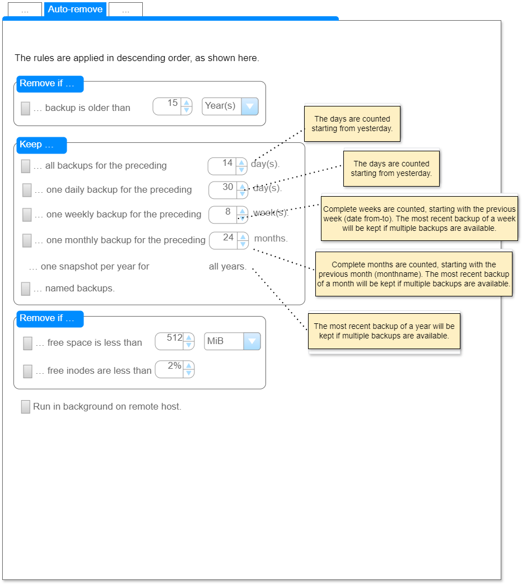

<!--
SPDX-FileCopyrightText: © 2024 Christian Buhtz <c.buhtz@posteo.jp>

SPDX-License-Identifier: GPL-2.0-or-later

This file is part of the program "Back In Time" which is released under GNU
General Public License v2 (GPLv2). See LICENSES folder or go to
<https://spdx.org/licenses/GPL-2.0-or-later.html>
-->
# Auto- & Smart-Remove
## Table of contents
* [Introduction](#introduction)
* [What we know](#what-we-know)
* [How it could be](#how-it-could-be)

# Introduction
The actual auto- and smart-remove behavior of BIT will be described in this
document. Don't take this as a regular user manual. The document will help to
decide how that feature can be revised. See
[Meta Issue #1945](https://github.com/bit-team/backintime/issues/1945) about
the background story.

This is how it looks like currently:

# What we know
## Location in code
* `common/snapshots.py`
  * `Snapshots.freeSpace()` is the main entry for the overall logic.
  * `Snapshots.smartRemoveList()` is called by `freeSpace()` and is the entry
    for _Smart remove_ related rules.

## Ordering and interference of the rules
1. Remove snapshots older than N years/weeks/days.
2. Smart-remove rules with calling `Snapshots.smartRemoveList`.
   1. Don't if there is only one backup left.
   2. Always keep the latest/youngest backup.
   3. Keep one per day for N days.
   4. Keep one per week for N weeks.
   5. keep one per month for N months.
   6. Keep one per year for all years.
3. Free space: Remove until there is enough.
4. Free inodes: Remove until there are enough.

## Details
- In `smartRemoveList()` the direction of ordering of the initial snapshots
  list is of high relevance.

### Older than N years
- Happens in `Snapshots.freeSpace()`
- Relevant also `self.config.removeOldSnapshotsDate()`
- Backups removed immediately before executing any other rule.
- Named snapshots ignored and kept.

### Smart remove: Daily
GUI wording: _Keep all snapshots for the last `N` day(s)._

Current behavior of the algorithm:
* Bug was that in some cases `N-1` days are kept.
  * Reason was that not dates but snapshotIDS (included their tags, the last 3
    digits) are used for comparison.
  * The bug is fixed.

### Smart remove: Weekly
GUI wording: _Keep one snapshot per week for the last `N` week(s)._

Current behavior of the algorithm:
* A "week" is defined based on the weekdays Monday to Sunday.
* The first week BIT is looking into is the current week even if it is not
  completed yet. E.g. today is Wednesday the 27th November, BIT will look
  for existing backups starting with Sunday the 24th ending and including the
  Saturday 30th November.
* If there is no backup in the current week found, that week is "lost" and
  there will only be `N-1` backups in the resulting list of weekly backups.
* See
  * [#1094](https://github.com/bit-team/backintime/issues/1094)
  * [PR #1944](https://github.com/bit-team/backintime/pull/1944)
  * [PR #1819](https://github.com/bit-team/backintime/pull/1819)

### Smart remove: Monthly
- GUI wording: _Keep one snapshot per months for the last `N` month(s)._
- Seems to use the current month, too.
- Keeps the oldest, so it is the 1th of each months.

### Smart remove: One per year for all years
- s
### Free space
- Remove until enough free disc space (`self.config.minFreeSpaceMib()`).
- Immediately removed before executing any other rule.

### Free inodes
- Remove until enough free inodes (`self.config.minFreeInodes()`)
- Immediately removed before executing any other rule.

# How it could be
## Overview
The following does not reflect the real behavior. It is a draft and suggestion
for the auto-/smart-remove related behavior of BIT and how to implement it.

## General
- Wording: Remove "Smart" and make everything "Auto remove".
- The rules should to be consistent in their behavior.
  - Always keep the latest/newest element in the list (Sunday for weeks, 31th
    for months, ...).
  - Ignore the current running/incomplete time frame.
- Wording: Use the term "backup" instead of "snapshot". See Issue #1929.

## Mockup

[autoremove_mockup.drawio](_images/autoremove_mockup.drawio)

## Rules in details
For new wording see the mockup.

1. Remove snapshots older than N years.
   - No need for modification.
2. Smart-remove rules with calling `Snapshots.smartRemoveList`.
   1. Don't if there is only one backup left.
      - No need for modification.
   2. Always keep the latest/youngest backup.
      - No need for modification.
   3. Keep one per day for N days.
      - Ignore "today", the current day.
      - Keep the latest/newest backup per day.
   4. Keep one per week for N weeks.
      - Define "week" as calendar element from Monday to Sunday.
      - Ignore the current running and incomplete week.
      - Keep the latest/newest backup per week. So it would be Sunday in most
        cases if available.
   5. keep one per month for N months.
      - Ignore the current running and incomplete month.
      - Keep the latest/newset backup per months (30th/31th day of the months).
   6. Keep one per year for all years.
      - Use the latest day of year.
      - That implicit ignores the current running year.
3. Free space: Remove until there is enough.
   - No need for modification.
4. Free inodes: Remove until there are enough.
   - No need for modification.

December 2024
